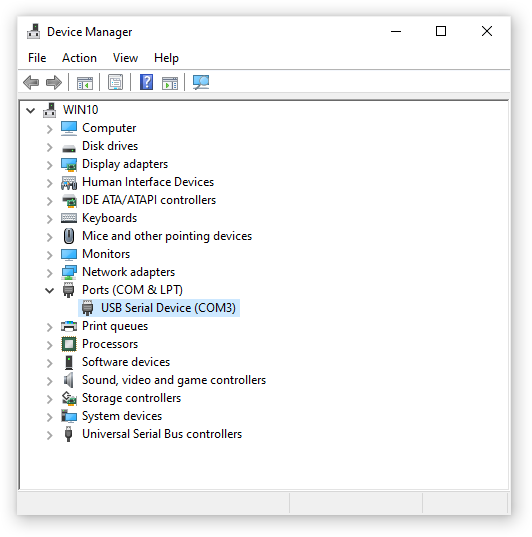
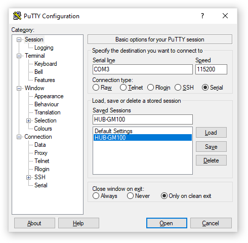
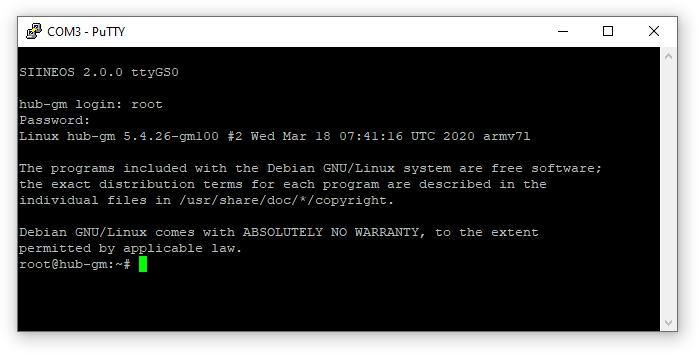

.. index:: First use

Preparing for first use
=======================

.. index:: Driver installation, Installing drivers, USB drivers

Installing drivers
------------------

Please connect a micro-USB cable to the front USB connector of the HUB-GM100 and to your PC. In most cases, the USB port of a PC provides sufficient power to operate the HUB-GM100 without an additional external power supply. After connecting the micro-USB cable, observe the status LED of the device. It should start to light up and blink after a while, signaling the startup of the SIINEOS operating system running on the device. If this is the first time you connect the HUB-GM100 to your PC, some drivers will be installed on your PC after the HUB-GM100 has finished booting. After that you can see a new serial connection in the Windows Device Manager, like shown in :numref:`WindowsDeviceManager` where COM port 3 is enumerated for the serial connection of the HUB-GM100 gateway.

.. note:: If the gateway’s status LED does not light up, no additional drivers are installed onto your Windows system or no new device is shown in the Windows Device Manager, there might be a problem regarding the power supply of the gateway. In that case, please use an external power supply for the gateway (see the gateway’s operation manual for further details).

.. _WindowsDeviceManager:

	Windows Device Manager

.. important:: If you encounter problems during the driver installation, please refer to the :ref:`UsbDriverIssues` section in the :ref:`Troubleshooting` chapter.

.. index:: PuTTY, Logging in, Baud rate

.. _LoggingIn:

Logging in
----------

In order to access the HUB-GM100, a software for remote login via virtual COM ports and SSH is required. On Windows a free software called *PuTTY* is a good choice. Download and install the program from the `PuTTY website <https://www.chiark.greenend.org.uk/~sgtatham/putty/latest.html>`_.

After downloading and installing PuTTY, start the program and configure it to connect to the HUB-GM100 using the virtual serial port and a baudrate of *115200* as shown in :numref:`PuttyStart`.

.. _PuttyStart:

	PuTTY Configuration

If configured correctly, a terminal window should appear (please press the :kbd:`Return` key if the terminal appears without any output), that requires you to log in to SIINEOS, the Linux-based operating system of the HUB-GM100.

.. index:: Credentials, Username, Password, Superuser

.. note:: The correct credentials on the terminal window are username ``root`` with password ``hubadmin``. Due to security concerns root login is available only via a serial port connection (e.g. using PuTTY), and not with via a SSH connection! When connecting to the HUB-GM100 via SSH, log in with username ``hubadmin`` and password ``hubadmin`` and make use of the ``su`` command to gain superuser rights, if necessary.

If this works (see figure :numref:`PuttyLogin` as an example), you have successfully connected to the HUB-GM100 and logged in to SIINEOS.

.. _PuttyLogin:

	HUB-GM100 login via PuTTY

.. index:: SSH service

.. _SshService:

.. important:: For security reasons, the SSH service on the HUB-GM100 is switched off by default and not started at boot automatically. Whenever you want to transfer files from or to the gateway e.g. via ``scp`` or *WinSCP*, please start the SSH service using the following command: ``systemctl start ssh``.

