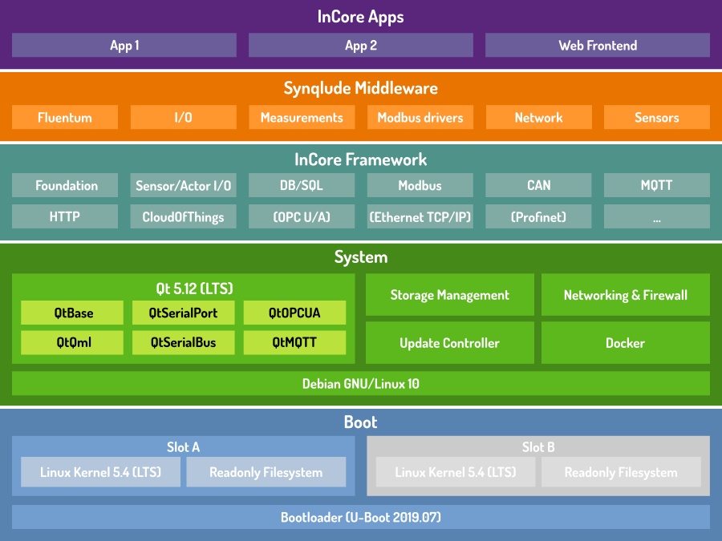

Overview
========

.. index:: Architecture, Operating system layers, Bootloader, Kernel, Qt, Networking, Firewall, Update Controller, Docker, QML Runtime, InCore Framework, Synqlude Middleware

Architecture
------------

The general architecture of the whole SIINEOS software stack is shown in :numref:`Architecture`. A device with a clean SIINEOS installation is equipped with the lower three OS layers. The upper two application layers are installed by system vendors or during application development.

.. _Architecture:

	Architecture of SIINEOS 2

Boot
	This layer consists of components required for starting up the device, initializing the hardware and loading the OS filesystem. The bootloader is a very basic software which performs basic hardware initialization, determines the active boot slot and loads and starts the Linux kernel. The Linux kernel contains all required hardware drivers, CPU & memory management code and many other components such as the TCP/IP networking stack. Once the kernel has been started, it mounts a readonly filesystem image (``rootfs``) in combination with a RAM-based overlay for write operations. Afterwards control is passed over to ``systemd``, the primary system management process.

System
	All components in this layer are part of the root filesystem and are based on a minimalistic Debian GNU/Linux 10 installation. The *Qt Framework* comes with modules required for platform abstraction, system and file I/O, serial port and bus access and others. The SIINEOS system layer provides various services for storage, network and firewall management, installation of system updates and running both InCore and Docker apps.

InCore Framework
	The InCore Framework consists of modules containing ready to use software blocks (objects) for building IoT/IIoT applications and is built ontop of Qt, especially the QtQml module. SIINEOS ships with highly optimized and target-CPU specialized InCore builds for superior performance. Refer to the `InCore Framework Documentation <https://incore.readthedocs.io/>`_ for further information.

Synqlude Middleware
	The Synqlude (Synergetic QML Includes) Middleware is a collection of high-level reusable components implemented in QML using the InCore Framework. These components implement commonly required functionalities such as generic measurement recording and cloud submission mechanisms.

InCore Apps
	Applications written in QML/Javascript based on the InCore Framework and optionally the Synqlude Middleware are run by the QML Runtime. Since apps only instantiate, parametrize and link high level blocks they are usually very lightweight and consist of a few dozen to a few hundred lines of code only.
